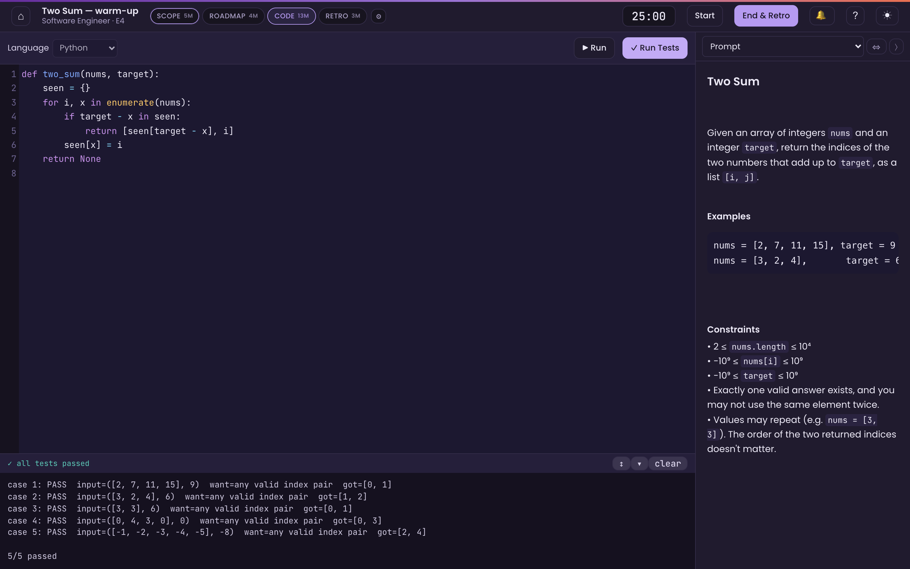
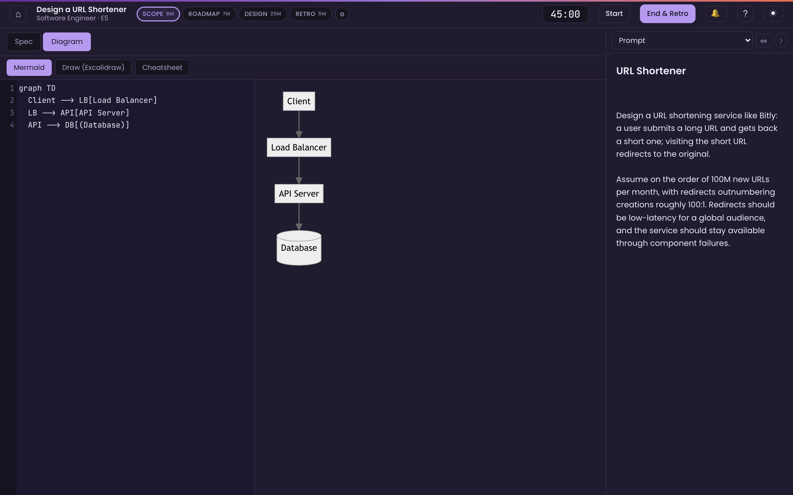
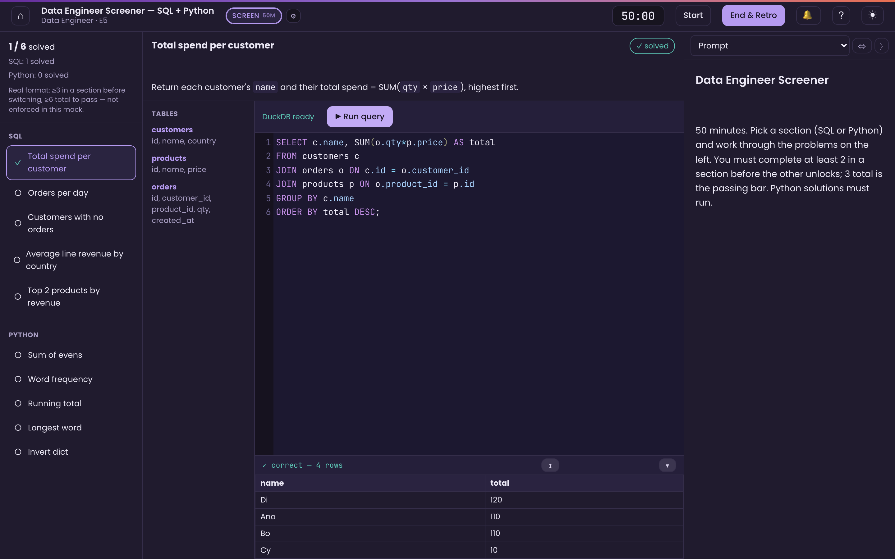
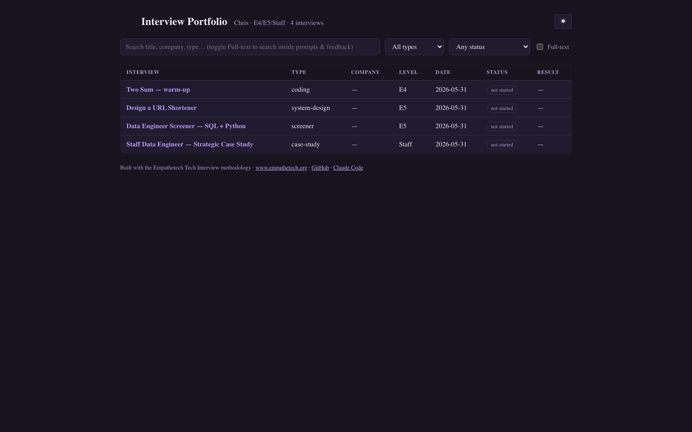

# mock-interview

A [Claude Code](https://claude.com/claude-code) skill that builds and runs **realistic, interactive mock
interviews for any role or field** — behavioral, case/consulting, product, design, data, finance, academic,
and more — and is *especially* deep for technical interviews via Empathetech's "Tech Interview Office Hours"
methodology (**Scope → Roadmap → Code/Design → Retro**).

Claude plays the **interviewer in the terminal** — conversing with you and reading any work you produce in
flight, so the interview runs on your existing Claude subscription with **no extra API cost**. The surface
matches the interview: a technical round gives you a real code editor that runs tests, a system-design diagram
canvas, or a live SQL console; a case or take-home gives you a deliverable workspace; a behavioral or panel
round is simply the prompt, a notes pad, and a realistic conversation. At the end you get a critical, honest
**Plus / Minus / Delta** retro, and every session is saved to a local portfolio you can grow over time.

## What it looks like

| Coding / DSA — real editor, executable tests | Product / system design — live diagram canvas |
| :---: | :---: |
|  |  |
| **Data screener — DuckDB SQL console + executable Python** | **Portfolio — your saved interviews, searchable** |
|  |  |

Other interview types include case studies with timed multi-round stakeholder loops, cloud/deploy, and your
own hybrid drills.

## Install

This is a Claude Code skill — drop it in your Claude Code **skills** directory and it activates whenever you
ask for interview practice (or type `/mock-interview`).

**Requirements:** [Claude Code](https://claude.com/claude-code), `git`, and **python3** (for the local
interview server). `node` and `gh` are optional — see [Dependencies](#dependencies).

Clone this repo into your personal skills directory:

**macOS / Linux**
```bash
git clone https://github.com/empathetech/mock-interview ~/.claude/skills/mock-interview
```

**Windows (PowerShell)**
```powershell
git clone https://github.com/empathetech/mock-interview "$env:USERPROFILE\.claude\skills\mock-interview"
```

That's the whole install. Open Claude Code and say *"mock interview me for a senior backend coding round"*
(or run `/mock-interview`). The skill scaffolds a local interview UI into `~/mock-interviews/` on first use —
nothing else to set up.

- **Update:** `git -C ~/.claude/skills/mock-interview pull` (macOS/Linux), or
  `git -C "$env:USERPROFILE\.claude\skills\mock-interview" pull` (Windows).
- **Project-local instead of global?** Clone into `<your-project>/.claude/skills/mock-interview`.

## Three pathways

1. **Company-specific** — give Claude your real loop details (recruiter email, prep doc, take-home brief) and
   it reconstructs that interview as faithfully as possible, supplementing from public sources where your docs
   are silent (your docs always win on conflicts).
2. **Catalog** — pick a type for your role + level across fields: technical (DS&A coding, product/system
   design, cloud/deploy, data/SQL/ML — built on the Empathetech method), behavioral/leadership, case/
   consulting, product management, design, and other domain-specific interviews.
3. **Hybrid / custom** — "drill me on window functions," "design a rate limiter," "grill me on my leadership
   stories," "run me through a market-sizing case" — assembled from the same building blocks, scoped to your ask.

## What makes it realistic

- **Fidelity** — a coding round is a CoderPad-style editor that executes real tests against a timer; system
  design gives you a spec + live Mermaid/Excalidraw diagram; a data screen is a real DuckDB SQL console; a
  case study is a deliverable workspace with timed stakeholder rounds.
- **Honest evaluation** — hints like a real interviewer (calibrated, never the answer), then a no-glazing
  retro that tells you where you actually stand.
- **In character** — Claude stays in the interviewer persona; step out for a meta question any time ("can we
  pause for a sec?") and step back in.

## Interview types

**Technical (richest tooling):** coding/DSA, product/system design (Mermaid + Excalidraw), data/SQL
(DuckDB-WASM), and multi-section timed screeners (e.g. SQL + executable Python).
**Case & deliverable-based:** case/consulting and product interviews with a deliverable workspace + timed
multi-round stakeholder loops.
**Conversational:** behavioral, leadership, panel, and other non-technical rounds — just the prompt, a notes
pad, and a realistic conversation; no specialized UI needed.

All composed from one reusable shell + a shared editor component. Light/dark themed, WCAG-AA,
keyboard-accessible.

## Dependencies

Near-zero-install by design: the local server (`scripts/serve.py`) is **Python-stdlib only**, and all UI
libraries load from CDN with offline fallbacks. Run `scripts/preflight.py` to check your setup — only
**python3** is required; `node` (for executing JavaScript answers), `gh` (for contributing), and internet
(for the rich editor/diagram libs) are optional.

## Contributing interviews back

Built a great interview? You can contribute a **generalized, scrubbed** version back to the community catalog
by opening an issue here (label `interview-contribution`), credited to your GitHub handle. Contributions must
be company-agnostic and free of any confidential/NDA material from a real loop — a generalized interview, not
a leak. See `references/contributing.md`.

## Attribution

Built on the **Empathetech** Tech Interview methodology — [empathetech.org](https://www.empathetech.org) ·
[github.com/empathetech](https://github.com/empathetech) — with Claude Code. Office Hours core contributors:
Molly Jean Bennett, John Hyland, Chris Ling, and Julie Nisbet.

## Layout

```
SKILL.md                  # the skill (loaded by Claude Code)
references/                # methodology, interview types, UI architecture, persona, design system, components, contributing
assets/shell/              # the reusable interview UI (copied once into a user's portfolio)
assets/templates/          # interview loader + portfolio dashboard
scripts/                   # serve.py (local server), preflight.py (dependency check)
```
